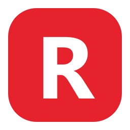

# 🚀 Roblox Asset Proxy (`rbx-asset-proxy`)

<p align="center">
  
  <br>
  <b>Lightweight Windows System Tray Proxy & DNS Fix for Roblox Textures, Thumbnails, and Assets</b>
  <br>
  <i>Лёгкий локальный прокси в системном трее Windows для обхода блокировок картинок, скинов и текстур в Roblox с нулевым влиянием на игровой пинг.</i>
</p>

<p align="center">
  <a href="https://hits.sh/github.com/lobzik645/rbx-asset-proxy/"></a>
  
  
  
  
  <a href="https://t.me/artehall"></a>
  <a href="https://t.me/+IcRgeI5RJqs2NDdi"></a>
</p>

---

<p align="center">
  <a href="#-english">English</a> • <a href="#-русский">Русский</a>
</p>

---

## 🇬🇧 English

### ⚡ The Problem
In certain regions (notably Russia / CIS), Roblox players frequently encounter gray/blank place icons, unloaded avatar headshots, missing 3D textures, and meshes. 

**Root Cause:**
1. **DNS & GeoDNS Failure**: Roblox migrated its primary asset and thumbnail delivery to `tr.rbxcdn.com`. Local ISP DNS resolvers fail to resolve the domain due to CNAME delegation (`trns1.rbxcdn.com -> trak.rbxcdn.com`) and GeoIP restrictions.
2. **Game vs. Assets Protocol**: While the game physics and multiplayer run on direct UDP, all thumbnails, meshes, sounds, and textures are fetched over HTTPS via `*.rbxcdn.com`.
3. **Why VPN is sub-optimal**: Routing all PC traffic through a VPN drastically increases game ping and burdens your bandwidth.

### 🎯 What `rbx-asset-proxy` Does
- **Zero Impact on Game Ping**: Only asset and CDN requests (`*.rbxcdn.com`, `*.roblox.com`) are proxied. All game server UDP traffic goes directly to Roblox servers at minimum latency.
- **Embedded 1-Click DNS Fix**: Solves the `CURLOPT_ERRORBUFFER: Could not resolve host: tr.rbxcdn.com` error inside the Roblox launcher and 3D engine.
- **DNS-over-HTTPS (DoH)**: Resolves target domains via Google/Cloudflare DoH with Client Subnet masking (`edns_client_subnet=0.0.0.0/0`), retrieving direct working Akamai and CloudFront IPs.
- **Silent Windows System Tray**: Runs in the background without annoying CMD/console windows. Click the tray icon near the clock to access settings and a live request monitor.
- **Optional TLS Packet Splitting (DPI Bypass)**: Can split initial TLS ClientHello packets across TCP segments to evade ISP SNI packet dropping.

### 📦 Installation & Usage

#### Option 1: Standalone EXE (Recommended)
1. Download **`RobloxProxy.exe`** from the [Releases](https://github.com/) section.
2. Run `RobloxProxy.exe`.
3. Click **"⚡ Починить картинки и плейсы в лаунчере"** (or approve the one-time Windows UAC prompt).
4. Launch Roblox — all icons and textures will load immediately!

#### Option 2: Run from Source
```bash
git clone https://github.com/YOUR_USERNAME/rbx-asset-proxy.git
cd rbx-asset-proxy
pip install -r requirements.txt
pythonw tray_app.py
```

### 💖 Support the Author / Donate
`RobloxProxy` is 100% free and open-source. If it helped you unblock and restore missing Roblox textures, avatars, and game icons, feel free to support the developer:

* 💳 **Bank Card:** `2200 7021 6738 7641`
* 💎 **TON / Gram (DeFi):** `UQCn9ZKq8URRXFgv0zEQa9AbIQNqS6tN3xRI6p5u0vE2a9TL`

### 👤 Author & Community
* ✈️ **Developer Telegram:** [@artehall](https://t.me/artehall)
* 📢 **Personal Telegram Channel:** [Join Channel](https://t.me/+IcRgeI5RJqs2NDdi)

---

## 🇷🇺 Русский

### ⚡ В чём суть проблемы?
В последнее время игроки в Roblox сталкиваются с тем, что в лаунчере и игре перестают прогружаться значки плейсов (серые квадраты), аватарки друзей и 3D-текстуры карт.

**Точная причина сбоя:**
1. **Сбой DNS-резолвинга**: Roblox перенёс доставку ассетов на домен `tr.rbxcdn.com`. Российские провайдерские DNS возвращают ошибку `NXDOMAIN` (из-за цепочки CNAME и блокировок Akamai/GeoDNS).
2. **Разделение трафика в Roblox**: Игровой процесс (мультиплеер, движение) идёт напрямую по **UDP**, а все картинки, скины и звуки качаются по **HTTPS** с серверов CDN.
3. **Почему VPN неудобен**: Обычный VPN пускает всю игру через чужую страну, из-за чего взлетает игровой пинг.

### 🎯 Что делает `rbx-asset-proxy`?
- **Родной минимальный пинг**: Проксирует **только** загрузку ассетов (`*.rbxcdn.com`, `*.roblox.com`). Игровой процесс идёт напрямую без задержек.
- **Встроенный DNS-фикс в 1 клик**: Прописывает рабочий IP для `tr.rbxcdn.com`, устраняя ошибку движка `Could not resolve host: tr.rbxcdn.com`.
- **Встроенный DoH (DNS-over-HTTPS)**: Запрашивает адреса напрямую у Cloudflare/Google с маскированием подсети (`edns_client_subnet=0.0.0.0/0`), минуя фильтры провайдера.
- **Работает в системном трее**: Никаких висящих черных окон командной строки. Программа сворачивается в иконку у часов.
- **Автозапуск с Windows**: Можно включить запуск при старте системы в один клик.

---

### 🛠️ Быстрый старт

1. Скачайте **`RobloxProxy.exe`** из раздела [Releases](https://github.com/).
2. Запустите `RobloxProxy.exe`.
3. В окне программы нажмите синюю кнопку **`⚡ Починить картинки и плейсы в лаунчере (1 клик)`** и подтвердите права администратора в окне Windows (кнопка станет зелёной ✅).
4. Запустите лаунчер Roblox — все значки плейсов, аватарки и текстуры загрузятся моментально!

---

### ⌨️ Меню в трее (правый клик по иконке у часов):
- 🟢 **Обход: Включен / Выключен** — мгновенное управление системным прокси.
- ⚙️ **Настройки и журнал...** — открывает панель управления и живой лог запросов.
- 🚀 **Автозапуск с Windows** — автоматический запуск вместе с системой.
- ❌ **Выход** — возвращает все настройки сети Windows в исходное состояние и завершает работу.

---

### 🌐 Опционально: Cloudflare Worker (`worker.js`)
В репозитории приложен шаблон `worker.js`. Если у вашего провайдера заблокированы сами IP-адреса CDN, этот скрипт можно бесплатно развернуть в Cloudflare Workers и туннелировать запросы ассетов через сеть Cloudflare.

---

## 💖 Поддержка разработчика / Донат

Программа полностью бесплатна и сделана для игроков. Если благодаря `RobloxProxy` у вас заработал лаунчер и прогрузились текстуры с аватарками — вы можете поддержать автора любой суммой:

* 💳 **Банковская карта (RU):** `2200 7021 6738 7641`
* 💎 **TON / Gram (DeFi):** `UQCn9ZKq8URRXFgv0zEQa9AbIQNqS6tN3xRI6p5u0vE2a9TL`

### 👤 Автор и контакты
* ✈️ **Telegram автора:** [@artehall](https://t.me/artehall)
* 📢 **Личный канал автора:** [Перейти в канал](https://t.me/+IcRgeI5RJqs2NDdi)

---

## 📄 Лицензия / License
Распространяется под лицензией **MIT**. Подробнее см. в файле [LICENSE](LICENSE).
